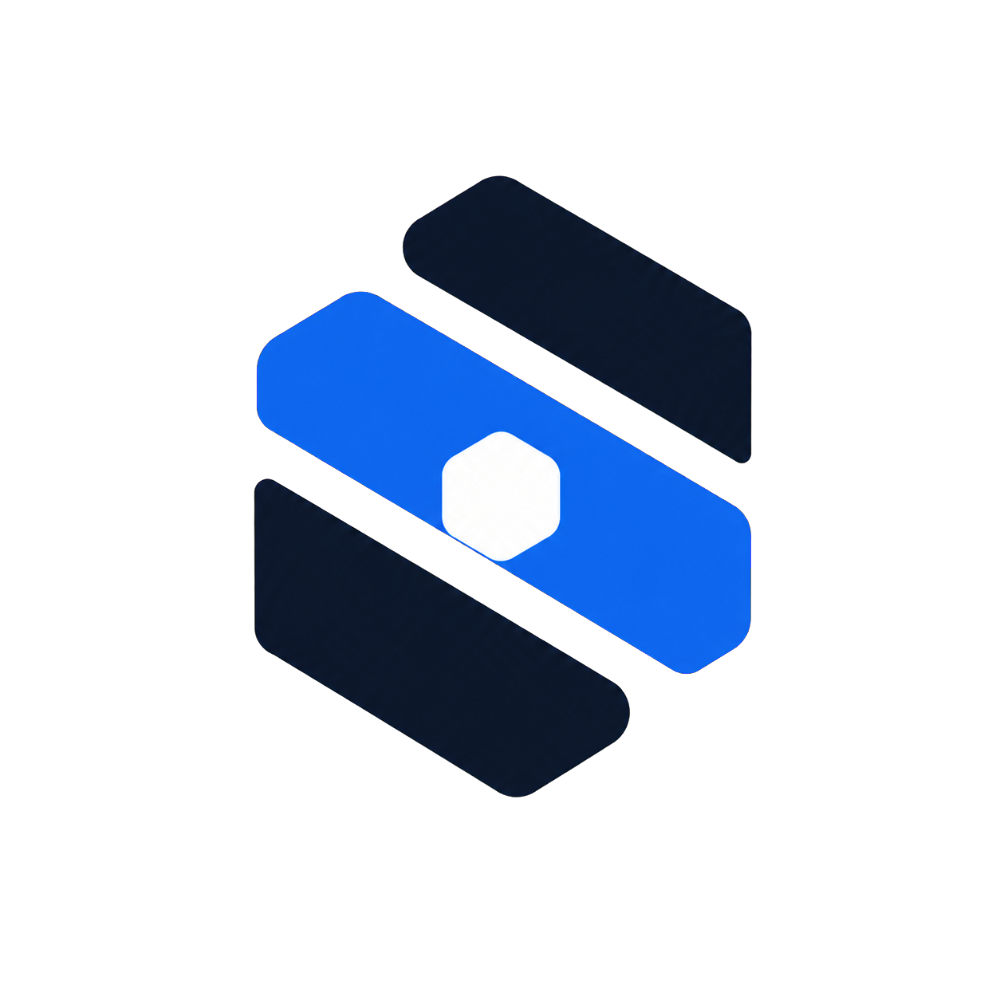
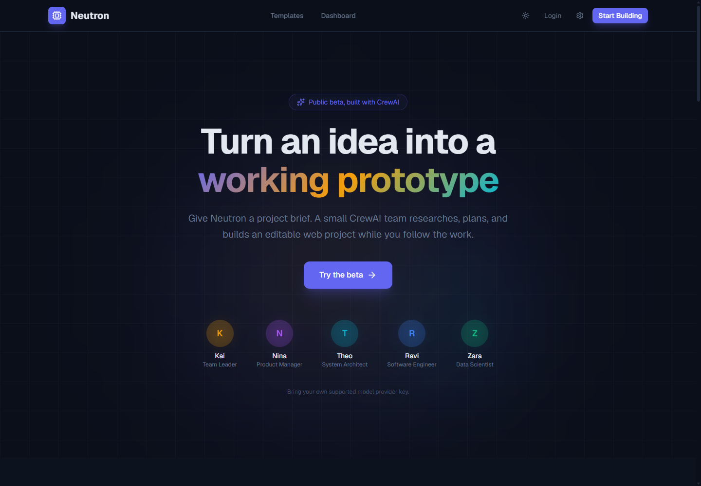
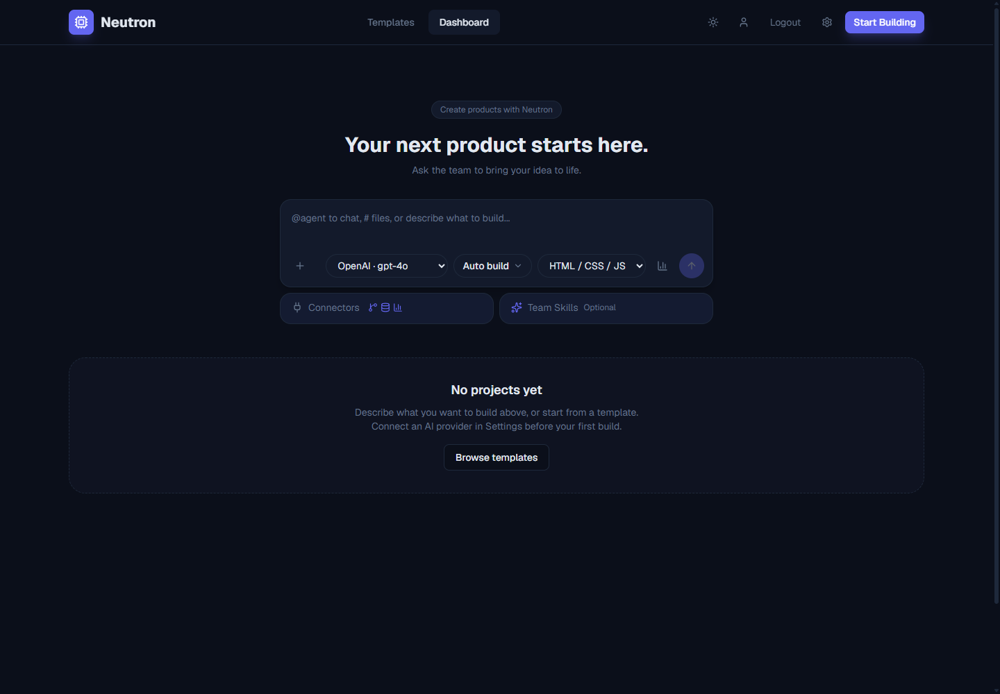
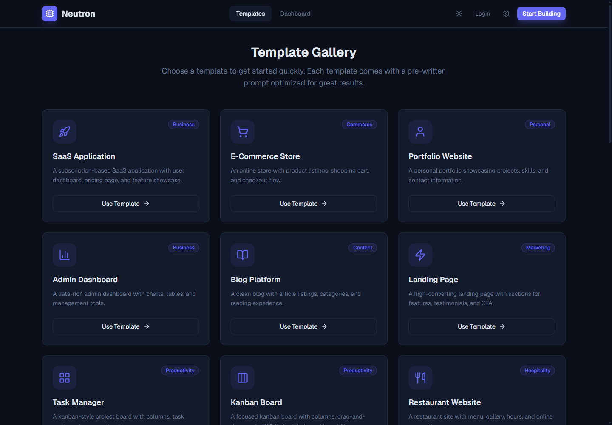
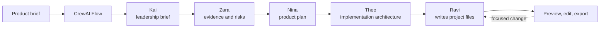

# Neutron

<p align="center">
  
</p>

<p align="center">
  
  
  
</p>

Neutron is a self-hosted workspace for turning a product brief into a small, editable web prototype with a CrewAI-powered delivery flow.

It is for builders who want to see the work between "I have an idea" and "here are the files": the brief, the product decisions, the technical plan, and the implementation. You can review each stage, request a change, inspect the result in the browser, and export the files.

> [!WARNING]
> Neutron sends your brief and the context you choose to share to your configured model provider. Generated code can be incomplete, incorrect, or unsafe. Do not upload credentials, customer data, or other sensitive material, and do not deploy generated output without your own review and testing.

## Screenshots

<p align="center">
  
</p>

<table>
  <tr>
    <td></td>
    <td></td>
  </tr>
  <tr>
    <td align="center">Dashboard composer</td>
    <td align="center">Template gallery</td>
  </tr>
</table>

## What you can do

- Start a project from a short brief or a template.
- Choose a fast static build or a Next.js App Router project.
- Follow the project team as it turns that brief into a scoped build.
- Pause at review points to approve an output or ask for a revision.
- Give the engineer a focused follow-up request after the first build.
- Preview the generated app, read its files, compare edits, undo a recent edit when available, and download a ZIP.
- Attach files, project skills, and selected MCP connectors as optional context.

Neutron runs on your infrastructure and uses the model provider account you connect. It does not include managed hosting, a shared model-credit pool, or a guarantee that a generated project is production-ready.

## The CrewAI workflow

CrewAI is the orchestration layer inside Neutron, not a label applied to a single chat prompt. A `ProjectCreationFlow` coordinates the work, holds the project state, emits progress, and records checkpoints. Each stage creates a focused CrewAI `Agent`, `Task`, and sequential single-agent `Crew`; the completed stage becomes context for the next one.



The full flow has five deliberate handoffs:

| Stage | CrewAI agent | Output used by the next stage |
|---|---|---|
| Leadership | Kai, Team Leader | A bounded brief: requirements, assumptions, constraints, and success criteria. |
| Analysis | Zara, Research Analyst | Evidence, product patterns, risks, and recommendations. Zara distinguishes supplied evidence from assumptions. |
| Planning | Nina, Product Manager | A prioritized MVP plan, user journeys, acceptance criteria, and milestones. |
| Architecture | Theo, System Architect | A practical file, UI, and interaction plan for the selected stack. |
| Engineering | Ravi, Senior Web Engineer | Static HTML/CSS/JS or Next.js files written through Neutron's project tools. |

The flow runs each handoff in order. In the workspace, progress is streamed to the browser over WebSocket, including phase state, tool activity, and token-use updates. When review is enabled, the flow waits on a feedback event before proceeding. Checkpoints let an interrupted project resume from the latest saved point.

This design is intentionally conservative. Agents do not delegate to an uncontrolled sub-team, and they do not rely on hidden long-term memory. The project brief, approved phase output, selected skills, uploads, and connector context are the inputs passed forward. That makes a build easier to inspect and cheaper to reason about when something goes wrong.

### Build modes

**Goal mode** is the default "Auto build" path on the dashboard. It runs the full CrewAI flow without stopping for review between phases. Use it when you want the fastest first pass.

**Team mode** is the same full flow, but it pauses for review between phases. Use it when the idea needs product thinking before code.

**Engineer mode** goes straight to Ravi. Use it for a contained implementation request when you already know the shape of the result.

After a build, a focused edit request runs the engineer against the existing project files and records a before-and-after snapshot for review. A consult request can ask one of the planning agents for advice without starting a new full build.

## Running Neutron locally

The shortest path is Docker Desktop. You need [Docker Desktop](https://www.docker.com/products/docker-desktop/) and [Git](https://git-scm.com/downloads).

```bash
git clone https://github.com/kdkiss/neutron.dev.git
cd neutron.dev
```

Create the backend settings file:

```powershell
Copy-Item backend\.env.example backend\.env
```

On macOS or Linux, use `cp backend/.env.example backend/.env` instead. Then start the two services:

```bash
docker compose up --build -d
```

Open [http://localhost:3000](http://localhost:3000), create a local account, and add a supported provider in **Settings > Cloud & AI**. Begin with a small brief and review the result before relying on it. Stop the stack with `docker compose down`; named volumes keep projects and the database until you explicitly remove them.

If the page does not open, run `docker compose ps` and wait for the services to become healthy. If a build cannot begin, check the provider configuration and whether the selected model is available to that API key. Never include keys, cookies, upload contents, or `.env` files in a public issue.

## Developing the application

Neutron has separate frontend and backend packages that communicate over HTTP and WebSocket.

```powershell
# Terminal 1
cd backend
python -m venv .venv
.venv\Scripts\Activate.ps1
pip install -e ".[dev]"
Copy-Item .env.example .env
uvicorn app.main:app --reload --port 8000
```

```powershell
# Terminal 2
cd frontend
npm install
npm run dev
```

The frontend runs at [http://localhost:3000](http://localhost:3000). Set `NEXT_PUBLIC_API_URL` in `frontend/.env.local` only if the API is not on port 8000.

### Repository map

| Location | Purpose |
|---|---|
| `backend/app/crew/flows/project_flow.py` | The CrewAI Flow: sequencing, state, checkpoints, feedback, token tracking, and recovery. |
| `backend/app/crew/agents/` | The five focused CrewAI agent definitions. |
| `backend/app/crew/tasks/` | Prompt and structured-output contracts for each phase. |
| `backend/app/crew/tools/` | The file-reading and file-writing tools available to the engineer. |
| `backend/app/api/websockets/project_ws.py` | The live workspace protocol and flow runner. |
| `frontend/src/components/workspace/` | The review workspace, preview, code view, uploads, and agent activity UI. |

## Beta boundaries

Neutron is a public beta intended for small, supervised builds.

| Available now | Outside the beta's scope |
|---|---|
| Local accounts, per-user provider configuration, project history, file uploads, and selected connector context. | A managed cloud, shared model billing, or one-click production deployment. |
| A visible multi-stage CrewAI workflow, human review, static or Next.js previews, ZIP export, and focused iterations. | A claim that generated code has passed security review, accessibility review, or production testing. |
| Limits for build tokens, concurrent builds, and uploads that operators can tune. | Unbounded public traffic or unattended agent execution. |

Uploads and connector results are model context. Only add information you are allowed to send to the provider you selected. Models can refuse requests, time out, use more tokens than expected, or produce inaccurate output.

## Operating a hosted beta

The repository includes two hosted paths: `docker-compose.prod.yml` with Caddy for a single-host setup, and `render.yaml` plus `vercel.json` for a Render/Vercel split setup. Before exposing an instance to other people:

1. For the Caddy setup, set `DOMAIN`, `BASIC_AUTH_USER`, and `BASIC_AUTH_HASH`, or remove Basic Auth only after replacing it with the access policy you want.
2. Set `APP_ENV=production`, an exact `FRONTEND_URL`, `COOKIE_SECURE=true`, and a unique `CREDENTIAL_ENCRYPTION_KEY`.
3. Configure `NEXT_PUBLIC_API_URL` and `NEXT_PUBLIC_APP_URL` for the public frontend.
4. Keep `ALLOW_SHARED_PROVIDER_KEYS=false` unless you intend to pay for other users' builds.
5. Set a modest `MAX_CONCURRENT_BUILDS` and `MAX_BUILD_TOKENS`, then monitor provider spend, storage, failures, and browser errors.
6. Use HTTPS and keep the backend configuration and generated project storage private.

Start with a small tester group. The right time to widen access is after you understand the cost, failure, and support profile of your chosen models.

## Checks

```powershell
# frontend
cd frontend
npm run lint
npm test -- --run
npm run build
npm audit --omit=dev --audit-level=high
```

```powershell
# backend
cd backend
python -m pytest --no-cov
python -m pytest
```

The full backend command runs the repository's strict branch-coverage gate. Keep the coverage policy in place when adding behavior; do not lower it to make a build appear healthy.

## Independence and trademarks

Neutron is an independent project built by one developer. It is not affiliated with, endorsed by, sponsored by, or supported by CrewAI, Atoms, MetaGPT, or their respective teams. The CrewAI name is used only to describe the framework incorporated into this project. All product names and trademarks belong to their respective owners.

## License

Neutron is released under the MIT License. See `LICENSE` for details.

## Reporting a problem

For a beta issue, include the Neutron commit, provider and model name (never the key), exact non-sensitive reproduction steps, expected and actual behavior, and sanitized logs or screenshots. For a security issue, contact the repository owner privately rather than publishing exploit details or credentials.
